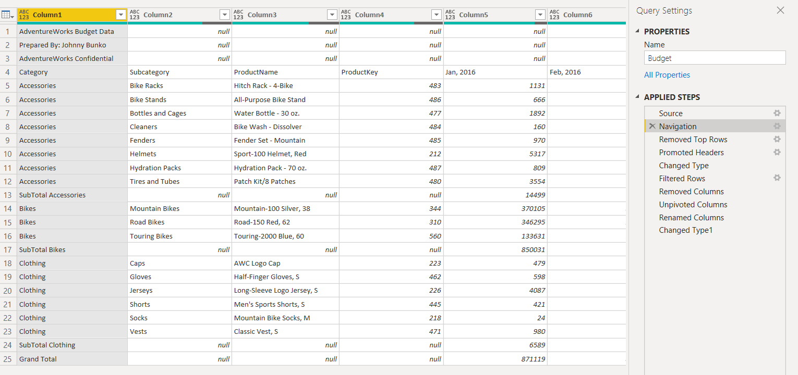

# PowerBI

This repository is dedicated to my educational journey learning Power BI.

My first report created is a 2016 Sales & Budget Report for the company Adventure Works, a sample relational database with tables containing information such as Sales, Customers, Budget, Territories, Products, and a Calendar for the years 2014-2017.

## Data Cleaning

The first step to any practiced data analysis is data cleaning. With this database, the only data that had to be cleaned was in the Budget table. In the Excel file that the data originated from, the table included column names within the rows, Total Values, and the column headers as row values.

To clean this up properly for mapping keys between tables later on, I removed the top rows without budget data. Then I promoted the column names to become the headers, as well as changing the date data types. Finally, I unpivoted the columns so that the dates wouldn't be the column headers, and each month/year would be listed as its own row. 

After this step, my second task was to map the relationships between the data tables (Sales & Budget) and the lookup tables (Customer, Product, Territories & Calendar). This step is crucial when working with relational databases, because without mapping keys between data tables and lookup tables, analyses would only be possible with independent tables.

My goal was to first create a table showing the Sales and Budget values for each month of the 2016 fiscal year. Then I would calculate Variance with a Data Analysis Expression (DAX), which is calculated as (Variance = Sales - Budget). This value would determine how much of sales went over the budget for that month. The final value I wanted to add to the table was Variance %, calculated as (Variance% = Variance/Budget), or what percentage of the budget sales exceeded.

Creating the table itself was simple: a drag and drop function of the Year and Month values. To calculate Sales and Budget, I used explicit measures to calculate the sum of all Budget Amounts as well as the sum of all Sales Amounts. I dragged these values into the table. I followed the same steps for both the Variance and Variance% values as well, ending up with a comprehensive picture of Adventure Works' Sales and Budget for 2016. 

The company earned $16,473,618 in sales, with a total budget of $16,869,574 for 2016. Ultimately, the company did not go over budget, with a surplus of $395,956 left over at the end of the year, which was approximately 2.35% of the total budget.

## Reporting

The final part of my analysis came with creating my reporting dashboard. I wanted to express my findings in a clearly communicative and interactive dashboard, along with extra charts showing additional information, such as Sales and Budget by Product Category, Sales and Budget by Month, Variance by Category, Variance by Month, and Top Selling Products & Customers. 

With Power BI, creating a dashboard came very easily. I simply clicked which chart types I wanted and included the axes (Category, Subcategory, Month, etc.) as well as the data I wanted visualized (Variance, Sales, and Budget).

To differentiate the colors of the bar charts, I formatted data colors using a scale. 

To create the tables showing Top Products By Sales and Top Customers By Sales, I used filters to only visualize the top 10 by Sales, which removed the table scrolling function, but would give a comprehensive look into the top selling products and top customers. 

Finally the dashboard is done! The follow shows the dashboard in all its beautiful glory, and if you right-click the bar charts and click 'Drill Down', you'll also be able to see the data by SubCategory.

Dashboard:

Drill Down Dashboard:

